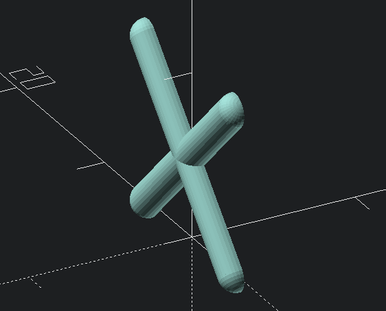
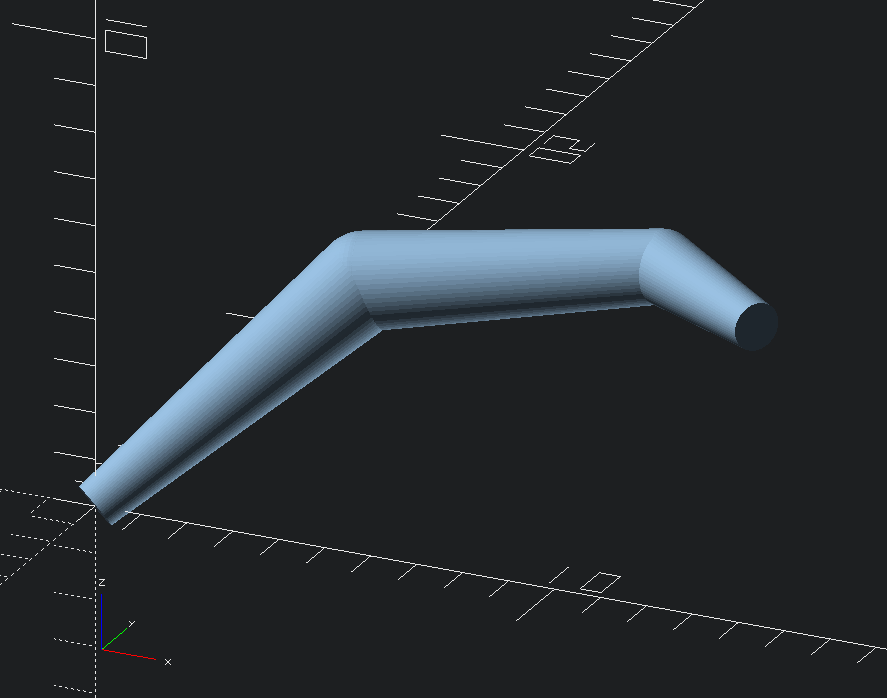

oscat - Random Dump of OpenSCAD Stuff
=====================================

This is my personal dumping ground for various things I've written in OpenSCAD which may be handy
for other people.

The individual files will be in the `src/` directory, with documentation for them in `doc/`.

License
-------

LGPLv3. See "LICENSE.txt" in the root directory of this repository for the full license text.

Overview
--------

### crossbrace

Generate a rounded crossbrace that's cut in half, for strengthening parts without using too much
material.

### torus

Generate a torus or a torus pipe (a torus with a straight middle section).

### quickmaffs

Various utility math functions.

### snek

Generate cylinders of varying dimensions along a path. Uses spheres to join them so needs decently
high `$fn` number to not look like complete doodoo.
