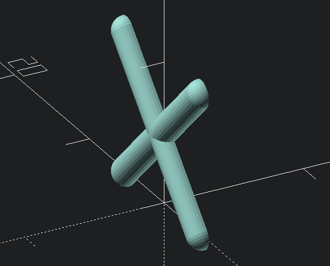

crossbrace
==========

Generate a rounded crossbrace that's cut in half, for strengthening parts without using too much
material.

Usage
-----

`crossbrace(width, height, diameter, flattening=1.0)`

* `width`: the width you wish to cover with the brace
* `height`: the height you wish to cover with the brace
* `diameter`: the diameter of the individual struts
* `flattening`: a scaling factor to "flatten" or "squish" (or even raise!) the bracing
  *(default: 1.0)*
