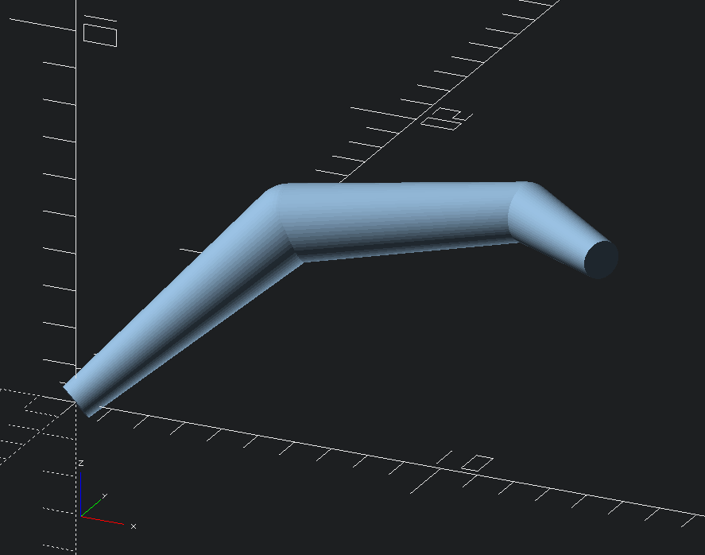

snek
====



Generate cylinders of varying dimensions along a path. Uses spheres to join them so needs decently
high `$fn` number to not look like complete doodoo.

Usage
-----

`snek(path=[[x, y, z, d], [x, y, z, d], ...])`

* `path`: a list of points consisting of `x`, `y` and `z` coordinates as well as a diameter.

### Example

```
use <snek.scad>;

snek([
    [0,0,0,1],
    [4,4,4,2],
    [10,5,5,1.5],
    [13,3,5,1],
], $fn=64);
```
