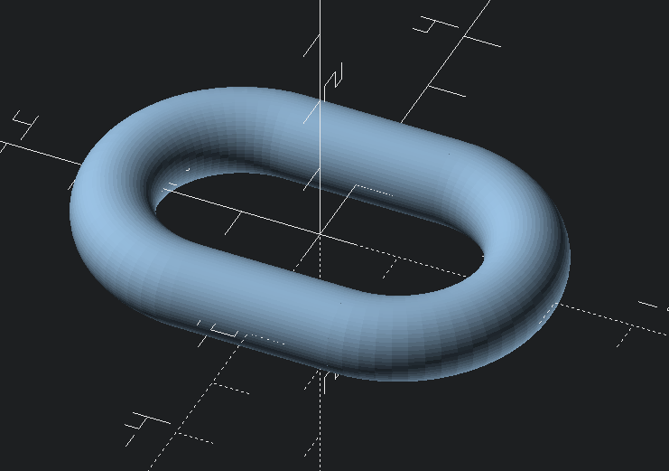

torus
=====


Generate a torus.

Usage
-----

`torus(inner_diameter, outer_diameter, center=false, angle=360)`

Generate a torus with the specified inner/outer diameter. If center is `false`, the torus will be
positioned such that 0,0,0 is the corner of its bounding box.

* `inner_diameter`: the inner diameter of this torus
* `outer_diameter`: the outer diameter of this torus
* `center`: whether to center the torus *(default: false)*
* `angle`: how much torus you want in your torus *(default: 360, all the torus)*

toruspipe
=========

Generate a torus pipe (a torus with a straight middle section).

Usage
-----

`toruspipe(inner_diameter, outer_diameter, height=1, center=false)`

Generate a hollowed out cylinder with tori capping off the ends. If center is `false`, the
toruspipe will be positioned such that 0,0,0 is the corner of its bounding box.

* `inner_diameter`: the inner diameter of this toruspipe
* `outer_diameter`: the outer diameter of this toruspipe
* `height`: the height of this toruspipe *(default: 1)*
* `center`: whether to center the toruspipe *(default: false)*

chainlink
=========



Generate a chainlink, that is two half-tori with a straight section inbetween. If you want them to
fit together, be sure to use a width that is larger than the diameter.

Usage
-----

`chainlink(length, width, diameter)`

* `length`: the length of the *inner* section of the chainlink
* `width`: the width of the *inner* section of the chainlink
* `diameter`: the diameter of the material that makes up the chainlink

### Example

```
use <torus.scad>

// generate a chainlink with interior length of 4, interior width of 2, and diameter of 1
chainlink(4, 2, 1);
```
